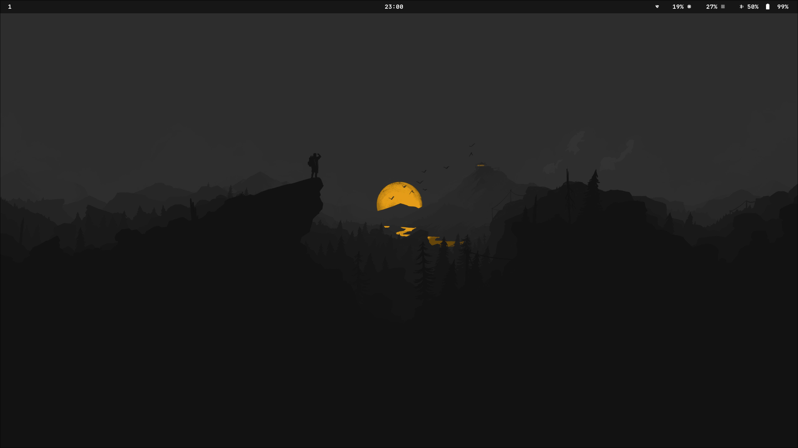
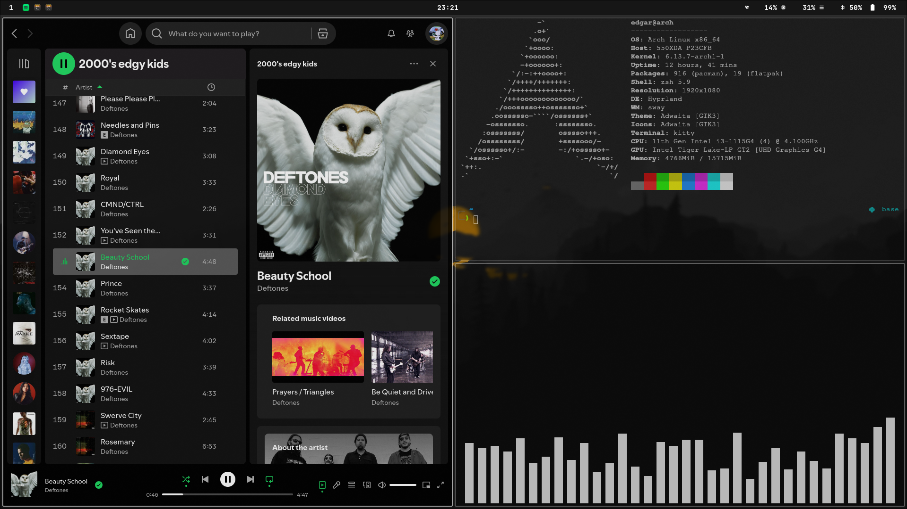

## meus dotfiles Arch Linux e Hyprland

---
Programas utilizados: 

 - terminal: `kitty`
 - editor de codigo: `neovim`
 - status bar: `waybar`
 - window manager: `hyprland`
 - wallpaper: `hyprpaper`
 - lançador de aplicativos: `rofi`

`full_screen.sh`: shell script para deixar uma das janelas abertas em tela cheia

`rofi-wifi-menu.sh`: shell script para utilizar o rofi como menu de wifi
